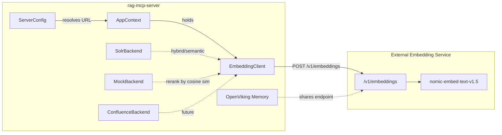

# Shared Embedding Client via External Llama Stack / Ollama

## Current state

The `rag-mcp-server` knowledge backends (mock, solr, confluence) all
use keyword/BM25 search exclusively. No embedding model runs
in-process.

The optional OpenViking memory backend delegates semantic search to an
external OpenViking server which itself uses **Ollama** with
`nomic-embed-text` (768 dimensions) at `http://127.0.0.1:11434/v1`.

Llama Stack (lightspeed-core) also exposes a compatible
`/v1/embeddings` endpoint with `nomic-ai/nomic-embed-text-v1.5` on
port 8321.

Both services share the **OpenAI-compatible embeddings API**:

```
POST /v1/embeddings
{
  "model": "nomic-ai/nomic-embed-text-v1.5",
  "input": ["query text"]
}
→ {"data": [{"embedding": [0.1, ...], "index": 0}]}
```

## Why

Keyword search fails on semantic queries like *"how does Nova handle
live migration failures during host evacuation"*. If the embedding model
is already running (for OpenViking memories) — we can call it
from knowledge backends too.

Adding a shared `EmbeddingClient` lets any backend opt into
semantic/hybrid search without loading models in-process or adding
heavy dependencies.

## Requirements

- **R1:** When OpenViking memory is enabled (`memory_backend=openviking`),
  the embedding client is automatically available using the same
  Ollama/Llama Stack endpoint.
- **R2:** The embedding client can also be enabled independently via
  `RAG_MCP_EMBEDDING_URL` for setups without OpenViking.
- **R3:** When neither condition is met, all backends operate in
  keyword-only mode (current behavior).
- **R4:** The embedding client is a thin `httpx` POST — no
  `llama-stack-client` SDK dependency.
- **R5:** The Solr backend gains optional `semantic` and `hybrid`
  search modes when embeddings are available and the target Solr
  collection supports `DenseVectorField`.
- **R6:** The mock backend reranks keyword-matched results by cosine
  similarity when embeddings are available, improving relevance
  ordering for large knowledge directories.

## Use Cases

- **U1:** As a developer using `rag-mcp-server` with OpenViking
  memories enabled, I want my knowledge search queries to also benefit
  from semantic understanding (the embedding model is already running).
- **U2:** As a team running Llama Stack externally, I want to point
  `rag-mcp-server` at the stack's `/v1/embeddings` endpoint for
  hybrid search without running Ollama separately.
- **U3:** As a developer using the mock backend with many knowledge
  files, I want results ordered by semantic relevance (not just keyword
  overlap count) so the most useful documents appear first.
- **U4:** As a user without any embedding service, I want the server
  to degrade gracefully to keyword search with no errors.

## Architecture

### Overview



### Trigger mechanism

The embedding client activates when **either** condition is true:

1. `RAG_MCP_EMBEDDING_URL` is explicitly set (highest priority)
2. `RAG_MCP_MEMORY_BACKEND=openviking` **and** `RAG_MCP_OPENVIKING_URL`
   is set — the embedding URL is derived as the Ollama endpoint that
   OpenViking depends on

Resolution logic in `ServerConfig`:

```python
@property
def effective_embedding_url(self) -> str | None:
    """Resolve the embedding endpoint.

    Priority:
    1. Explicit RAG_MCP_EMBEDDING_URL
    2. Derived from OpenViking's Ollama dependency
    3. None (embeddings disabled)
    """
    if self.embedding_url:
        return self.embedding_url
    if self.memory_backend == "openviking":
        # OpenViking requires Ollama; reuse its endpoint
        return self.embedding_ollama_url or None
    return None
```

### Configuration

New fields in `ServerConfig`:

| Field | Env var | Default | Purpose |
|-------|---------|---------|---------|
| `embedding_url` | `RAG_MCP_EMBEDDING_URL` | `""` | Explicit embedding endpoint (Llama Stack or Ollama base URL) |
| `embedding_model` | `RAG_MCP_EMBEDDING_MODEL` | `nomic-ai/nomic-embed-text-v1.5` | Model ID for `/v1/embeddings` |
| `embedding_ollama_url` | `RAG_MCP_EMBEDDING_OLLAMA_URL` | `http://127.0.0.1:11434` | Ollama base URL used when deriving from OpenViking |
| `solr_search_mode` | `RAG_MCP_SOLR_SEARCH_MODE` | `keyword` | One of `keyword`, `semantic`, `hybrid` |

```python
class ServerConfig(BaseSettings):
    # ... existing fields ...

    embedding_url: str = ""
    embedding_model: str = "nomic-ai/nomic-embed-text-v1.5"
    embedding_ollama_url: str = "http://127.0.0.1:11434"
    solr_search_mode: Literal["keyword", "semantic", "hybrid"] = "keyword"
```

### API changes

No MCP tool signature changes. The `search()` tool still accepts the
same arguments. When embeddings are available and `solr_search_mode`
is `semantic` or `hybrid`, the backend internally vectorizes the query
before calling Solr.

### Error handling

- If the embedding service is unreachable, log a warning and fall back
  to keyword search (never fail the MCP tool call).
- If the Solr collection lacks vector support but `solr_search_mode`
  is `hybrid`, fall back to BM25 keyword search with a logged warning.
- Timeout: 30s for embedding requests (configurable in future).

### Security considerations

- No credentials needed for local Ollama.
- For Llama Stack with auth, an optional `RAG_MCP_EMBEDDING_API_KEY`
  field can be added (future work — Llama Stack local dev has no auth).
- Embedding vectors are ephemeral (not stored by rag-mcp-server).

### Migration / backwards compatibility

Fully backwards-compatible. All new fields have defaults that preserve
existing keyword-only behavior.

## Implementation Suggestions

### Key files and insertion points

| File | What to do |
|------|------------|
| **New:** `src/rag_mcp/embeddings.py` | `EmbeddingClient` class (~60 lines) |
| **New:** `tests/test_embeddings.py` | Unit tests (mock httpx) |
| **Edit:** `src/rag_mcp/config.py` | Add 4 new fields + `effective_embedding_url` property |
| **Edit:** `src/rag_mcp/_app.py` | Init `EmbeddingClient` in `AppContext` when available |
| **Edit:** `src/rag_mcp/backends/__init__.py` | Pass embedding client ref to backends |
| **Edit:** `src/rag_mcp/backends/solr.py` | Add hybrid/semantic path |
| **Edit:** `src/rag_mcp/backends/mock.py` | Add embedding rerank after keyword match |
| **Edit:** `tests/test_config.py` | Test embedding URL resolution |
| **Edit:** `tests/test_mock_backend.py` | Test reranking with mocked embeddings |
| **Edit:** `README.md` | Document new env vars |
| **Edit:** mcp.json templates | Add `RAG_MCP_EMBEDDING_*` vars |

### EmbeddingClient implementation

```python
"""Thin async client for OpenAI-compatible /v1/embeddings endpoints."""

from __future__ import annotations

import logging
from typing import Optional

import httpx

logger = logging.getLogger(__name__)


class EmbeddingClient:
    """Async HTTP client for embedding generation."""

    def __init__(self, base_url: str, model: str, api_key: str = "") -> None:
        self._url = f"{base_url.rstrip('/')}/v1/embeddings"
        self._model = model
        self._headers: dict[str, str] = {"Content-Type": "application/json"}
        if api_key:
            self._headers["Authorization"] = f"Bearer {api_key}"
        self._client = httpx.AsyncClient(timeout=30.0)

    async def embed(self, texts: list[str]) -> Optional[list[list[float]]]:
        """Embed a batch of texts. Returns None on failure (graceful fallback)."""
        try:
            resp = await self._client.post(
                self._url,
                json={"model": self._model, "input": texts},
                headers=self._headers,
            )
            resp.raise_for_status()
            data = resp.json()["data"]
            return [item["embedding"] for item in sorted(data, key=lambda x: x["index"])]
        except (httpx.HTTPError, KeyError, TypeError) as exc:
            logger.warning("Embedding request failed: %s", exc)
            return None

    async def embed_query(self, text: str) -> Optional[list[float]]:
        """Embed a single query string."""
        result = await self.embed([text])
        return result[0] if result else None
```

### AppContext integration

```python
@dataclass
class AppContext:
    backend: BackendProtocol
    config: ServerConfig
    memory: MemoryProtocol | None = None
    embeddings: EmbeddingClient | None = None


@asynccontextmanager
async def _app_lifespan(server: FastMCP) -> AsyncIterator[dict]:
    config = _server_config or ServerConfig()
    backend = get_backend(config)
    memory = get_memory_backend(config)

    embeddings = None
    embed_url = config.effective_embedding_url
    if embed_url:
        from rag_mcp.embeddings import EmbeddingClient
        embeddings = EmbeddingClient(embed_url, config.embedding_model)
        logger.info("Embedding client enabled: %s model=%s", embed_url, config.embedding_model)

    yield {"app": AppContext(
        backend=backend, config=config, memory=memory, embeddings=embeddings,
    )}
```

### Solr backend hybrid search

When `solr_search_mode` is `semantic` or `hybrid` and
`app.embeddings` is not None:

1. Call `app.embeddings.embed_query(query)` to get a vector
2. POST to Solr's `/semantic-search` (semantic) or `/hybrid-search`
   (hybrid) endpoint with the vector
3. If embedding fails → fall back to existing `/select` BM25 path

The Solr hybrid endpoint format (from `solr_vector_io`):

```
POST /solr/{collection}/hybrid-search
Content-Type: application/x-www-form-urlencoded

q={text_query}&vector=[0.1,0.2,...]&topK={k}
```

### Mock backend embedding rerank

The mock backend currently scores by keyword overlap
(`hits / len(keywords)`). When `app.embeddings` is available, it can
rerank the keyword-matched results by cosine similarity for better
relevance ordering.

Algorithm:

1. Run existing keyword search to get candidate results (unchanged)
2. If `embeddings` is available and candidates exist:
   a. Embed the query: `q_vec = await embeddings.embed_query(query)`
   b. Embed each candidate's text (batch):
      `doc_vecs = await embeddings.embed([r["text"][:2000] for r in results])`
   c. Compute cosine similarity between `q_vec` and each `doc_vec`
   d. Replace the keyword `score` with `0.3 * keyword_score + 0.7 * cosine_sim`
   e. Re-sort by combined score
3. If embedding fails → keep original keyword ordering (graceful fallback)

Truncating document text to 2000 chars keeps embedding calls fast
(nomic-embed handles up to 8192 tokens but shorter is better for
latency in a reranking pass).

```python
async def _rerank_with_embeddings(
    self, results: list[dict], query: str, embeddings: EmbeddingClient
) -> list[dict]:
    """Rerank keyword results by cosine similarity to the query."""
    if not results:
        return results

    q_vec = await embeddings.embed_query(query)
    if q_vec is None:
        return results

    texts = [r["text"][:2000] for r in results]
    doc_vecs = await embeddings.embed(texts)
    if doc_vecs is None:
        return results

    for r, d_vec in zip(results, doc_vecs):
        cos_sim = _cosine_similarity(q_vec, d_vec)
        keyword_score = r["score"]
        r["score"] = round(0.3 * keyword_score + 0.7 * cos_sim, 4)

    results.sort(key=lambda r: r["score"], reverse=True)
    return results


def _cosine_similarity(a: list[float], b: list[float]) -> float:
    dot = sum(x * y for x, y in zip(a, b))
    norm_a = sum(x * x for x in a) ** 0.5
    norm_b = sum(x * x for x in b) ** 0.5
    if norm_a == 0 or norm_b == 0:
        return 0.0
    return dot / (norm_a * norm_b)
```

The `MockBackend.search()` method gains an optional `embeddings`
parameter (passed from `AppContext` by the tool). When set, it calls
`_rerank_with_embeddings` before returning.

### Test patterns

- Framework: `unittest` (project standard)
- Mock httpx with `unittest.mock.AsyncMock`
- Test `effective_embedding_url` property resolution for all 3 cases
- Test embedding fallback (503 from service → returns None)
- Test Solr backend graceful degradation

## Open Questions for Future Work

- **Embedding caching:** For repeated identical queries within a
  session, cache embeddings in-memory. Low priority — single-query
  latency from local Ollama is ~10ms.
- **Reranking weight tuning:** The 0.3/0.7 keyword/cosine blend is a
  starting point. May need per-backend or per-store tuning.
- **Confluence semantic search:** When Confluence adds vector support,
  the embedding client is ready.
- **Batch embedding for indexing:** If we add a `solr-vector` backend
  that indexes local markdown into Solr with vectors, the
  `EmbeddingClient.embed()` batch method handles it.
- **API key field:** Add `RAG_MCP_EMBEDDING_API_KEY` when targeting
  authenticated Llama Stack deployments.

## Changelog

| Date | Change | Reason |
|------|--------|--------|
| 2026-07-09 | Initial version | Spec created from plan |
