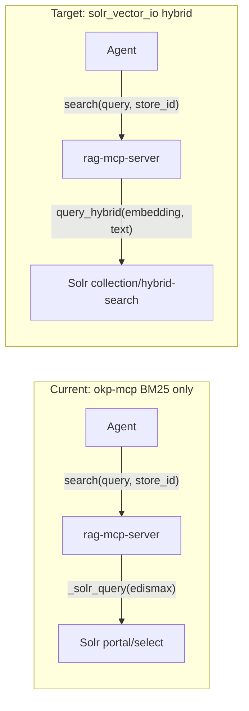

# Lightspeed-Core Solr Integration for Agentic SDLC

> **Status**: Proposal — not yet implemented.

## Current state

The existing `solr.py` backend imports from `okp-mcp` and does **BM25
eDismax** text search against the OKP `portal` core.  This is effective
for keyword-friendly queries like `"openstack ibm-z"` but poor for
semantic queries like `"how does Nova handle live migration failures
during host evacuation"`.

The lightspeed-core **`solr_vector_io`** provider
(`lightspeed-providers/lightspeed_stack_providers/providers/remote/solr_vector_io/`)
supports three search modes over Solr collections with
**DenseVectorField**:

| Mode | Solr endpoint | Mechanism |
|------|---------------|-----------|
| **Keyword** | `/select` | Standard text query |
| **Semantic** | `/semantic-search` | KNN over embedding vectors |
| **Hybrid** | `/hybrid-search` | Text query + `{!rerank}` with KNN re-ranking (`vector_boost` default 8.0) |

## Three integration options

### Option A: Import `SolrIndex` directly (lightest)

Import `SolrIndex` from `solr_vector_io` as a library, bypassing the
full Llama Stack adapter.  Call `query_keyword()`, `query_vector()`,
or `query_hybrid()` directly.

**Pros:**

- Minimal dependencies — just `solr_vector_io` + an embedding model
  (sentence-transformers)
- No Llama Stack runtime needed
- Fits the existing `BackendProtocol` cleanly
- Agent workflow unchanged — same `search(query, vector_store_id)` MCP
  interface

**Cons:**

- Must handle query embedding ourselves (load sentence-transformers
  model in-process)
- Tied to `SolrIndex` internals (not a public API)
- Requires Solr with DenseVectorField + `/semantic-search` and
  `/hybrid-search` handlers (not stock Solr)
- `SolrIndex` constructor needs `ChunkWindowConfig` and other Llama
  Stack types

**New backend file:** `src/rag_mcp/backends/solr_vector.py` (~120 lines)

**Config additions to `ServerConfig`:**

| Field | Example | Purpose |
|-------|---------|---------|
| `solr_collection` | `portal-rag` | Collection name (not hardcoded `portal`) |
| `solr_vector_field` | `chunk_vector` | DenseVectorField name |
| `solr_content_field` | `chunk` | Chunk text field |
| `solr_embedding_model` | `sentence-transformers/all-mpnet-base-v2` | Query embedding model |
| `solr_search_mode` | `hybrid` | One of `keyword`, `semantic`, `hybrid` |

**Dependencies:** add `solr_vector_io` (from lightspeed-providers) +
`sentence-transformers` + `numpy`

### Option B: Use Llama Stack as library client

Run Llama Stack **in-process** via `use_as_library_client: true` with
`solr_vector_io` registered as a provider.  Call
`client.vector_io.query()` from the backend.

**Pros:**

- Uses the official Llama Stack `VectorIO` interface (stable API)
- Gets embedding handling, chunk window expansion, hybrid mode
  selection for free
- Can combine BYOK stores (FAISS/pgvector) with Solr in the same
  query path
- Future-proof — new providers/modes work without backend changes

**Cons:**

- Heavy dependency — full `llama-stack` + inference provider
  in-process
- Startup time and memory (loading embedding model + Llama Stack
  framework)
- Overkill for a thin MCP server that just needs `search()`
- Config complexity (`run.yaml` generation, provider wiring)

### Option C: Llama Stack as external service + thin HTTP client

Run `llama stack run run.yaml` separately.  The `rag-mcp-server`
backend calls the Llama Stack HTTP API (`POST /vector_io/query`) as a
remote client.

**Pros:**

- Clean separation — rag-mcp-server stays thin
- Llama Stack handles embedding, provider routing, chunk expansion
- Can serve multiple MCP servers / agents from one Llama Stack
  instance
- BYOK + Solr + future providers all available

**Cons:**

- Requires running a separate service (operational overhead)
- Network hop adds latency
- Still need `llama-stack-client` dependency for the HTTP SDK
- More suited to team/production setups than individual developer SDLC

## Recommendation for agentic SDLC

**Option A** is the right fit — it keeps `rag-mcp-server` lightweight
and self-contained while unlocking semantic/hybrid search.  The key
insight is that `SolrIndex` is just an HTTP client with three query
methods; we don't need the full adapter/provider machinery.

The implementation would:

1. Create `src/rag_mcp/backends/solr_vector.py` that wraps `SolrIndex`
   (or reimplements the three HTTP calls — they're simple `httpx`
   requests)
2. Load a sentence-transformers model lazily on first semantic/hybrid
   query
3. Add `backend: "solr-vector"` to config with the new fields
4. Keep the existing `solr` (okp-mcp BM25) backend for the `portal`
   core without vectors

The existing `solr` backend stays as-is for OKP `portal` cores that
lack DenseVectorField.  The new `solr-vector` backend targets
collections built with `rag-content` or any Solr with the OKP RAG
prototype handlers.

## What about `rag-content`?

`rag-content` builds **FAISS / pgvector / sqlite-vec** stores, not
Solr indexes.  It is useful if you want to:

- Convert markdown repos into vector stores (like `knowledge/` but
  with embeddings)
- Use those stores via Llama Stack BYOK providers

For the `rag-mcp-server` mock backend, `rag-content` doesn't help
directly — it produces Llama Stack-format stores, not plain markdown
directories.  A future integration could add a `faiss` or `pgvector`
backend to `rag-mcp-server`, but that's a separate effort.

## Solr `solr_vector_io` API surface

Key classes from `lightspeed-providers`:

- **`SolrVectorIOConfig`** / **`ChunkWindowConfig`** — Pydantic config
- **`SolrIndex`** (`EmbeddingIndex`) — HTTP client with
  `query_vector()`, `query_keyword()`, `query_hybrid()`
- **`SolrVectorIOAdapter`** — Llama Stack `VectorIO` + OpenAI vector
  store mixin (read-only)

`SolrIndex` query methods:

| Method | Solr endpoint | Input | Notes |
|--------|---------------|-------|-------|
| `query_keyword(query_string, k, score_threshold)` | `GET /select` | Text | Strips `?` and `*` wildcards |
| `query_vector(embedding, k, score_threshold)` | `POST /semantic-search` | NDArray | Form-encoded vector string |
| `query_hybrid(embedding, query_string, k, score_threshold, reranker_type, reranker_params)` | `POST /hybrid-search` | Both | `{!rerank}` with KNN; `vector_boost` (default 8.0) |

All three support optional `chunk_filter_query` (e.g. `is_chunk:true`)
and chunk window expansion (fetching neighboring chunks to broaden
context).

## Files to change

- **New:** `src/rag_mcp/backends/solr_vector.py` — hybrid Solr backend
- **New:** `tests/test_solr_vector.py` — tests
- **Edit:** `src/rag_mcp/config.py` — add `solr-vector` backend +
  config fields
- **Edit:** `src/rag_mcp/backends/__init__.py` — factory wiring
- **Edit:** `pyproject.toml` — optional deps for sentence-transformers
- **Edit:** `README.md` — document the new backend
