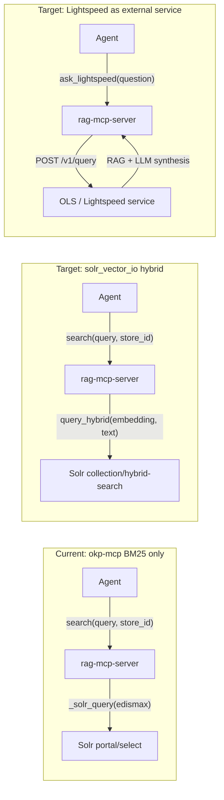

# Lightspeed-Core Solr Integration for Agentic SDLC

> **Status**: Proposal - not yet implemented.

## Current state

The existing `solr.py` backend imports from `okp-mcp` and does **BM25
eDismax** text search against the OKP `portal` core. This is effective
for keyword-friendly queries like `"openstack ibm-z"` but poor for
semantic queries like `"how does Nova handle live migration failures
during host evacuation"`.

The lightspeed-core **`solr_vector_io`** provider
(`lightspeed-providers/lightspeed_stack_providers/providers/remote/solr_vector_io/`)
supports three search modes over Solr collections with
**DenseVectorField**:

| Mode | Solr endpoint | Mechanism |
|------|---------------|-----------|
| **Keyword** | `/select` | Standard text query |
| **Semantic** | `/semantic-search` | KNN over embedding vectors |
| **Hybrid** | `/hybrid-search` | Text query + `{!rerank}` with KNN re-ranking (`vector_boost` default 8.0) |



## Embedding model vs LLM

Options below refer to "extra models." The two kinds differ
significantly:

|  | Embedding model | LLM |
|--|-----------------|-----|
| Purpose | Maps text → fixed-size numeric vector | Generates new text token by token |
| Typical size | 100–400 MB | 7–70+ GB (or API) |
| Hardware | CPU, milliseconds per query | GPU or paid API, seconds per query |
| Running cost | Zero (local, free) | Per-token or GPU time |
| Determinism | Yes - same input → same vector | No (temperature, sampling) |
| Hallucination risk | None (pure math) | Yes |
| Example | `sentence-transformers/all-mpnet-base-v2` | Claude, GPT-4, Granite, Llama 3 |

Options A–C (semantic/hybrid modes) need an **embedding model** - small,
free, CPU-friendly, loaded once in-process. Option D needs a **second
LLM** running inside the Lightspeed service (already deployed as
infrastructure).

## Four integration options

### Option A: Import `SolrIndex` directly (lightest)

Import `SolrIndex` from `solr_vector_io` as a library, bypassing the
full Llama Stack adapter. Call `query_keyword()`, `query_vector()`,
or `query_hybrid()` directly.

**Pros:**

- Minimal new dependencies - just `solr_vector_io` + an embedding
  model (~400 MB, CPU, free)
- No Llama Stack runtime or second LLM needed
- Fits the existing `BackendProtocol` cleanly
- Agent workflow unchanged - same `search(query, vector_store_id)` MCP
  interface

**Cons:**

- Must embed queries ourselves (load sentence-transformers in-process)
- Tied to `SolrIndex` internals (not a public API)
- Requires Solr with DenseVectorField + `/semantic-search` and
  `/hybrid-search` handlers - **the stock OKP `portal` core does not
  have these**; a purpose-built collection is needed
- `SolrIndex` constructor needs `ChunkWindowConfig` and other Llama
  Stack types

> **Note on keyword mode:** `SolrIndex.query_keyword()` also calls
> `/select`, which does work against the existing OKP `portal` core.
> However this is functionally identical to the current `solr` backend
> (okp-mcp eDismax). Option A's value is exclusively in
> unlocking semantic and hybrid search.

**Extra model required:** Yes - an **embedding model**.
~400 MB, runs on CPU, loaded lazily on first semantic/hybrid query.
Zero cost, no API key.

**New backend file:** `src/rag_mcp/backends/solr_vector.py` (~120 lines)

**Config additions to `ServerConfig`:**

| Field | Example | Purpose |
|-------|---------|---------|
| `solr_collection` | `portal-rag` | Collection name (not hardcoded `portal`) |
| `solr_vector_field` | `chunk_vector` | DenseVectorField name |
| `solr_content_field` | `chunk` | Chunk text field |
| `solr_embedding_model` | `sentence-transformers/all-mpnet-base-v2` | Query embedding model |
| `solr_search_mode` | `hybrid` | One of `keyword`, `semantic`, `hybrid` |

**Dependencies:** add `solr_vector_io` (from lightspeed-providers) +
`sentence-transformers` + `numpy`

### Option B: Use Llama Stack as library client

Run Llama Stack **in-process** via `use_as_library_client: true` with
`solr_vector_io` registered as a provider. Call
`client.vector_io.query()` from the backend.

**Pros:**

- Uses the official Llama Stack `VectorIO` interface (stable API)
- Gets embedding handling, chunk window expansion, hybrid mode
  selection for free
- Can combine BYOK stores (FAISS/pgvector) with Solr in the same
  query path
- Future-proof - new providers/modes work without backend changes

**Cons:**

- Heavy dependency - full `llama-stack` + inference provider
  in-process
- Startup time and memory (loading embedding model + Llama Stack
  framework)
- Overkill for a thin MCP server that just needs `search()`
- Config complexity (`run.yaml` generation, provider wiring)

**Extra model required:** Yes - an **embedding model**, loaded
in-process by Llama Stack's inference provider.

### Option C: Llama Stack as external service + thin HTTP client

Run `llama stack run run.yaml` separately. The `rag-mcp-server`
backend calls the Llama Stack HTTP API (`POST /vector_io/query`) as a
remote client.

**Pros:**

- Clean separation - rag-mcp-server stays thin
- Llama Stack handles embedding, provider routing, chunk expansion
- Can serve multiple MCP servers / agents from one Llama Stack
  instance
- BYOK + Solr + future providers all available

**Cons:**

- Requires running a separate service (operational overhead)
- Network hop adds latency
- Still need `llama-stack-client` dependency for the HTTP SDK
- More suited to team/production setups than individual developer SDLC

**Extra model required:** Yes - an **embedding model**, but it runs
inside the external Llama Stack service, not in `rag-mcp-server`.

### Option D: Lightspeed as external service (no local model)

Use an already-deployed OpenShift Lightspeed (OLS) or RHOSO Lightspeed
instance as the search backend. The agent persona formulates a natural
language question - the same way a human would ask Lightspeed in the
OpenShift console - and gets back a RAG-enriched, LLM-synthesized
answer.

```
Agent (Claude/GPT)
  └─ persona says "query Lightspeed for RHOSO context"
       └─ MCP tool: ask_lightspeed(question)
            └─ POST /v1/query → Lightspeed service
                 ├─ RAG retrieval (Solr hybrid + embeddings)
                 └─ LLM synthesis (Granite / Llama / …)
                      → natural language answer
```

This differs fundamentally from Options A–C: those return **raw
document chunks** that the agent model interprets; Option D returns a
**pre-synthesized answer** from a second LLM that already reasoned
over retrieved context.

**Pros:**

- No model management in `rag-mcp-server` at all - no embedding
  model, no sentence-transformers
- Leverages existing enterprise infrastructure (OLS is already
  deployed on the cluster)
- Full hybrid search quality without any local setup
- The Lightspeed LLM can apply domain-specific reasoning that raw
  chunks cannot
- Simple MCP tool - just an HTTP POST with a question string

**Cons:**

- Double LLM cost - the agent's model *and* the Lightspeed model
  both run per query
- Latency - full RAG pipeline + LLM inference (seconds, not
  milliseconds)
- "Telephone game" risk - information passes through two LLMs, each
  can hallucinate or compress
- Agent cannot see raw source documents (loses provenance / citations
  unless OLS returns them)
- Requires an OLS / Lightspeed deployment - not available for pure
  upstream or local-only development
- The Lightspeed answer targets a human mental model and may not match
  what the agent persona actually needs

**Extra model required:** No model loaded by `rag-mcp-server`. The
Lightspeed service has its own LLM + embedding models, but those are
pre-existing infrastructure - comparable to a database, not a new
dependency.

## Comparison: extra model requirements

| Backend / Option | Extra model in rag-mcp-server? | Extra external service? |
|------------------|-------------------------------|------------------------|
| **Mock** (current) | No | No |
| **Confluence** (current) | No | No (API only) |
| **Solr/okp-mcp BM25** (current) | No | No |
| **Option A - keyword mode** | No (but redundant with existing `solr` backend) | No |
| **Option A - semantic/hybrid** | **Embedding model** (~400 MB, CPU, free) | Solr with DenseVectorField |
| **Option B** | **Embedding model** (in-process via Llama Stack) | No |
| **Option C** | No | External Llama Stack (has embedding model) |
| **Option D** | No | Lightspeed service (has embedding model + LLM) |

## Recommendation for agentic SDLC

**Option A** is the best fit for local/CI workflows - it keeps
`rag-mcp-server` lightweight and self-contained while unlocking
semantic/hybrid search. The embedding model (~400 MB,
sentence-transformers) is small, free, and CPU-friendly - a different
class of dependency than a second LLM. The key insight is that
`SolrIndex` is just an HTTP client with three query methods; we don't
need the full adapter/provider machinery.

**Option D** is the best fit for teams that already have Lightspeed
deployed - it requires zero local model setup and returns richer
(LLM-synthesized) answers, at the cost of latency and double-LLM
token spend.

The two options are not mutually exclusive. A realistic setup
could use Option A for fast, precise document retrieval during code
review workflows, and Option D for high-level architectural questions
where Lightspeed's synthesized answers add value.

The implementation for Option A would:

1. Create `src/rag_mcp/backends/solr_vector.py` that wraps `SolrIndex`
   (or reimplements the three HTTP calls - they're simple `httpx`
   requests)
2. Load a sentence-transformers model lazily on first semantic/hybrid
   query
3. Add `backend: "solr-vector"` to config with the new fields
4. Keep the existing `solr` (okp-mcp BM25) backend for the `portal`
   core without vectors

The implementation for Option D would:

1. Create `src/rag_mcp/backends/lightspeed.py` - thin HTTP client
   calling `POST /v1/query`
2. Add `backend: "lightspeed"` to config with `lightspeed_url` and
   auth fields
3. Map the response into the existing `search()` result format

The existing `solr` backend stays as-is for OKP `portal` cores that
lack DenseVectorField. The new `solr-vector` backend targets
collections built with `rag-content` or any Solr with the OKP RAG
prototype handlers.

## What about `rag-content`?

`rag-content` builds **FAISS / pgvector / sqlite-vec** stores, not
Solr indexes. It is useful if you want to:

- Convert markdown repos into vector stores (like `knowledge/` but
  with embeddings)
- Use those stores via Llama Stack BYOK providers

For the `rag-mcp-server` mock backend, `rag-content` doesn't help
directly - it produces Llama Stack-format stores, not plain markdown
directories. A future integration could add a `faiss` or `pgvector`
backend to `rag-mcp-server`, but that's a separate effort.

## Solr `solr_vector_io` API surface

Key classes from `lightspeed-providers`:

- **`SolrVectorIOConfig`** / **`ChunkWindowConfig`** - Pydantic config
- **`SolrIndex`** (`EmbeddingIndex`) - HTTP client with
  `query_vector()`, `query_keyword()`, `query_hybrid()`
- **`SolrVectorIOAdapter`** - Llama Stack `VectorIO` + OpenAI vector
  store mixin (read-only)

`SolrIndex` query methods:

| Method | Solr endpoint | Input | Notes |
|--------|---------------|-------|-------|
| `query_keyword(query_string, k, score_threshold)` | `GET /select` | Text | Strips `?` and `*` wildcards |
| `query_vector(embedding, k, score_threshold)` | `POST /semantic-search` | NDArray | Form-encoded vector string |
| `query_hybrid(embedding, query_string, k, score_threshold, reranker_type, reranker_params)` | `POST /hybrid-search` | Both | `{!rerank}` with KNN; `vector_boost` (default 8.0) |

All three support optional `chunk_filter_query` (e.g. `is_chunk:true`)
and chunk window expansion (fetching neighboring chunks to broaden
context).

## Files to change

### Option A (solr-vector)

- **New:** `src/rag_mcp/backends/solr_vector.py` - hybrid Solr backend
- **New:** `tests/test_solr_vector.py` - tests
- **Edit:** `src/rag_mcp/config.py` - add `solr-vector` backend +
  config fields
- **Edit:** `src/rag_mcp/backends/__init__.py` - factory wiring
- **Edit:** `pyproject.toml` - optional deps for sentence-transformers
- **Edit:** `README.md` - document the new backend

### Option D (lightspeed)

- **New:** `src/rag_mcp/backends/lightspeed.py` - Lightspeed HTTP
  client
- **New:** `tests/test_lightspeed.py` - tests
- **Edit:** `src/rag_mcp/config.py` - add `lightspeed` backend +
  `lightspeed_url`, auth fields
- **Edit:** `src/rag_mcp/backends/__init__.py` - factory wiring
- **Edit:** `README.md` - document the new backend
