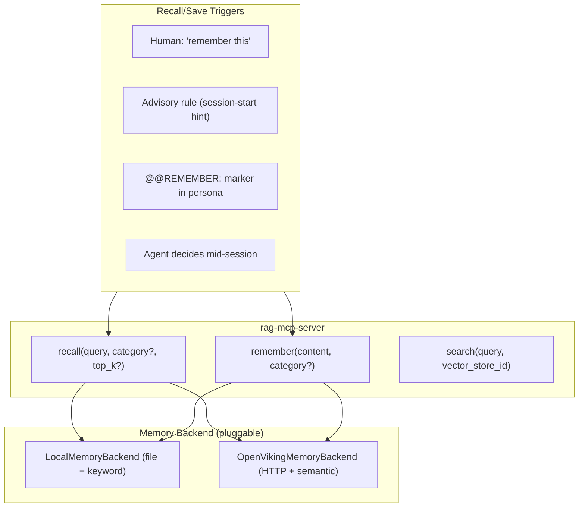

# Explicit Memory Tools for rag-mcp-server

## Summary

Cross-session memory via explicit `recall()` and `remember()` MCP tools.
Designed as the portable fallback (Path 2) for environments where
OpenViking's hook-based transparent memory is unavailable (i.e., any MCP
client other than Claude Code).

## Architecture



## Trigger mechanisms

Since MCP has no lifecycle events, the agent must be prompted to call
memory tools. Four viable triggers exist (from most to least reliable):

1. **Human instruction** — user says "remember that I prefer X" or
   "recall what we discussed about Y."
2. **Advisory rule** — always-loaded `.mdc` rule with `@@RECALL:` and
   `@@REMEMBER:` markers that resist attention decay.
3. **Persona description** — `@@REMEMBER:` instructions embedded in
   persona YAML for long-running subagents.
4. **Agent's own judgment** — tool schema clearly describes purpose;
   agent decides "this seems worth remembering."

## Tool definitions

### `recall(query, category?, top_k?)`

Find memories relevant to the query. Returns formatted markdown with
memory entries showing content, category, and when saved.

Parameters:
- `query` (required): What to recall — task context, topic, or question
- `category` (optional): Filter by preference/decision/learning/correction/context/workflow
- `top_k` (optional, default 5): Maximum results

### `remember(content, category?)`

Persist a memory for future sessions. Deduplicates by content hash
(local backend) or vector similarity (OpenViking backend).

Parameters:
- `content` (required): What to remember — specific and concise
- `category` (optional, default "context"): One of preference, decision,
  learning, correction, context, workflow

### The `workflow` category

Enables emergent workflow creation from session history. When the agent
successfully completes a multi-step procedure (with positive human
feedback), it can `remember()` the procedure as a workflow memory.

Workflow memories differ from knowledge store workflows:
- Emergent (discovered during sessions, not pre-authored)
- Personal (tied to a user's successful patterns)
- Provisional (may be promoted to a formal skill/workflow later)
- Enriched with human feedback

## Memory backend options (Option C: pluggable)

Config: `RAG_MCP_MEMORY_BACKEND=local|openviking|none`

### Local file store (default)

Memories stored as markdown with YAML frontmatter under
`RAG_MCP_MEMORY_DIR` (default `./.memories`), organized by category.
Recall uses keyword overlap scoring. Zero infrastructure.

### OpenViking delegation

Delegates to a running OpenViking instance via HTTP API. Provides
semantic recall via embedding-based search. Requires OV server +
embedding model. See below for "memories only" configuration.

### Disabled

`RAG_MCP_MEMORY_BACKEND=none` — memory tools respond with a message
saying memory is disabled. No overhead.

## Configuration

| Variable | Default | Description |
|----------|---------|-------------|
| `RAG_MCP_MEMORY_BACKEND` | `none` | Backend: `local`, `openviking`, `none` |
| `RAG_MCP_MEMORY_DIR` | `./.memories` | Local backend storage path |
| `RAG_MCP_OPENVIKING_URL` | `http://127.0.0.1:1933` | OV server URL |
| `RAG_MCP_OPENVIKING_ACCOUNT` | `default` | OV account header |
| `RAG_MCP_OPENVIKING_USER` | `default` | OV user header |
| `RAG_MCP_OPENVIKING_AGENT_ID` | `rag-mcp-server` | OV agent namespace |

## OpenViking "memories only" configuration

When using OV as the memory backend, it operates in reduced mode: no
resource ingestion, no VLM, no session compression. The agent explicitly
writes structured memory content via `remember()`.

Minimal `ov.conf`:

```json
{
  "storage": {
    "workspace": "~/.openviking/data",
    "vectordb": { "name": "memories", "backend": "local" },
    "agfs": { "backend": "local" }
  },
  "embedding": {
    "dense": {
      "provider": "ollama",
      "model": "nomic-embed-text",
      "api_base": "http://127.0.0.1:11434/v1",
      "dimension": 768
    }
  },
  "server": {
    "host": "127.0.0.1",
    "port": 1933,
    "auth_mode": "trusted"
  }
}
```

Key points:
- **No `vlm` section** — memories are pre-structured text from agent
- **`auth_mode: "trusted"`** — single-client local setup
- **Ollama embedding** — free, local, no API key required

## Degradation model

| Scenario | Recall trigger | Save trigger | Quality |
|----------|---------------|--------------|---------|
| Human says "remember X" | — | Immediate | Perfect |
| Human says "do you recall Y" | Immediate | — | Perfect |
| Advisory rule fires at session start | Auto | Agent's judgment | Good |
| `@@REMEMBER:` in persona | — | Agent's judgment | Good |
| Long session, rule drifted | Self-prompt | Self-prompt | Degraded |
| No rule, no persona, no human | Never | Never | None |

## Comparison with OpenViking hooks

| Dimension | Hooks (Claude Code only) | Explicit tools (any MCP client) |
|---|---|---|
| Recall reliability | 100% (every prompt) | ~80% at start, then degrades |
| Save reliability | 100% (every turn) | Human: 100%. Agent: ~60% |
| Token overhead | 0 (outside budget) | ~200 tokens per decision |
| Portability | Claude Code only | All MCP clients |

## Files created/changed

- `src/rag_mcp/memory/__init__.py` — MemoryProtocol + factory
- `src/rag_mcp/memory/local.py` — local file memory backend
- `src/rag_mcp/memory/openviking.py` — OpenViking delegation backend
- `src/rag_mcp/memory_tools.py` — recall() and remember() tool definitions
- `src/rag_mcp/config.py` — memory config fields added
- `src/rag_mcp/server.py` — memory backend in lifespan + AppContext
- `tests/test_memory_local.py` — local backend tests
- `templates/memory-advisory.mdc` — advisory rule template
- `pyproject.toml` + `requirements.txt` — pyyaml dependency

## Related documents

- [docs/openviking-comparison.md](../docs/openviking-comparison.md) —
  comparison and integration paths
- [specs/rag-mcp-server.md](./rag-mcp-server.md) — RAG MCP server design
