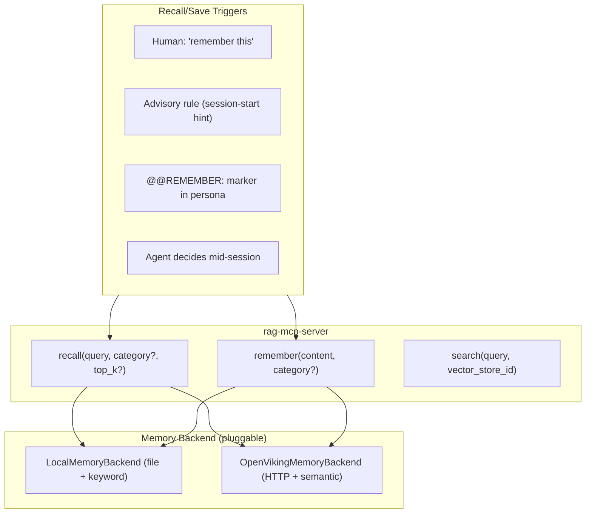

# Explicit Memory Tools for rag-mcp-server

## Summary

Cross-session memory via explicit `recall()` and `remember()` MCP tools.
Designed as the portable fallback (Path 2) for environments where
OpenViking's hook-based transparent memory is unavailable (i.e., any MCP
client other than Claude Code).

**Tool naming**: All tool names are prefixed by the server identity
(dashes → underscores) to avoid collisions between multiple instances.
For example: `rag_knowledge_recall`, `rag_knowledge_remember`,
`rag_knowledge_search`, `rag_knowledge_wiki_search`.

## Architecture


```mermaid
graph TD
    subgraph triggers ["Recall/Save Triggers"]
        HumanInstruction["Human: 'remember this'"]
        AdvisoryRule["Advisory rule (session-start hint)"]
        AtAtMarker["@@REMEMBER: marker in persona"]
        AgentDecision["Agent decides mid-session"]
    end

    subgraph ragMcp ["rag-mcp-server"]
        RecallTool["recall(query, category?, top_k?)"]
        RememberTool["remember(content, category?)"]
        ExistingSearch["search(query, vector_store_id)"]
    end

    subgraph memoryBackend ["Memory Backend (pluggable)"]
        LocalBackend["LocalMemoryBackend (file + keyword)"]
        OVBackend["OpenVikingMemoryBackend (HTTP + semantic)"]
    end

    triggers --> RecallTool
    triggers --> RememberTool
    RecallTool --> LocalBackend
    RecallTool --> OVBackend
    RememberTool --> LocalBackend
    RememberTool --> OVBackend
```

## Trigger mechanisms

Since MCP has no lifecycle events, the agent must be prompted to call
memory tools. Four viable triggers exist (from most to least reliable):

1. **Human instruction** — user says "remember that I prefer X" or
   "recall what we discussed about Y."
2. **Advisory rule** — always-loaded `.mdc` rule with `@@RECALL:` and
   `@@REMEMBER:` markers that resist attention decay.
3. **Persona description** — `@@REMEMBER:` instructions embedded in
   persona YAML for long-running subagents.
4. **Agent's own judgment** — tool schema clearly describes purpose;
   agent decides "this seems worth remembering."

## Tool definitions

### `recall(query, category?, top_k?)`

Find memories relevant to the query. Returns formatted markdown with
memory entries showing content, category, and when saved.

Parameters:
- `query` (required): What to recall — task context, topic, or question
- `category` (optional): Filter by preference/decision/learning/correction/context/workflow
- `top_k` (optional, default 5): Maximum results

### `remember(content, category?)`

Persist a memory for future sessions. Deduplicates by content hash
(local backend) or vector similarity (OpenViking backend — searches for
existing memories above `DEDUP_THRESHOLD` before writing; returns the
existing URI with `deduplicated=True` if a near-duplicate is found).

Parameters:
- `content` (required): What to remember — specific and concise
- `category` (optional, default "context"): One of preference, decision,
  learning, correction, context, workflow

### The `workflow` category

Enables emergent workflow creation from session history. When the agent
successfully completes a multi-step procedure (with positive human
feedback), it can `remember()` the procedure as a workflow memory.

Workflow memories differ from knowledge store workflows:
- Emergent (discovered during sessions, not pre-authored)
- Personal (tied to a user's successful patterns)
- Provisional (may be promoted to a formal skill/workflow later)
- Enriched with human feedback

## Memory backend options (Option C: pluggable)

Config: `RAG_MCP_MEMORY_BACKEND=local|openviking|none`

### Local file store (default)

Memories stored as markdown with YAML frontmatter under
`RAG_MCP_MEMORY_DIR` (default `./.memories`), organized by category.
Recall uses keyword overlap scoring. Zero infrastructure.

### OpenViking delegation

Delegates to a running OpenViking instance via HTTP API. Provides
semantic recall via embedding-based search. Requires OV server +
embedding model. See below for "memories only" configuration.

### Disabled

`RAG_MCP_MEMORY_BACKEND=none` — memory tools respond with a message
saying memory is disabled. No overhead.

## Configuration

| Variable | Default | Description |
|----------|---------|-------------|
| `RAG_MCP_MEMORY_BACKEND` | `none` | Backend: `local`, `openviking`, `none` |
| `RAG_MCP_MEMORY_DIR` | `./.memories` | Local backend storage path |
| `RAG_MCP_OPENVIKING_URL` | `http://127.0.0.1:1933` | OV server URL (use a host IP for sandbox access) |
| `RAG_MCP_OPENVIKING_ACCOUNT` | `default` | OV account header |
| `RAG_MCP_OPENVIKING_USER` | `default` | OV user header |
| `RAG_MCP_OPENVIKING_AGENT_ID` | `rag-mcp-server` | OV agent namespace |
| `RAG_MCP_OPENVIKING_API_KEY` | | OV API key (required for non-localhost / sandbox) |
| `RAG_MCP_OPENVIKING_DEDUP_THRESHOLD` | `0.85` | Write-time dedup: cosine similarity threshold. Memories scoring above this against existing content are skipped. 0 disables |
| `RAG_MCP_OPENVIKING_DEDUP_TURNS` | `5` | Recall-time dedup: cross-turn cooldown via OV context face. Prevents re-injecting the same memory across N turns. 0 disables |

## OpenViking "memories only" configuration

When using OV as the memory backend, it operates in reduced mode: no
resource ingestion, no VLM, no session compression. The agent explicitly
writes structured memory content via `remember()`.

> **Sandbox note:** When OV must be reachable from a container sandbox,
> bind to `0.0.0.0` (or the host's real IP) and set `root_api_key` in
> `ov.conf`. OV enforces API key auth on non-localhost binds. Set
> `RAG_MCP_OPENVIKING_URL` to the host IP (e.g. `http://10.0.0.7:1933`)
> and `RAG_MCP_OPENVIKING_API_KEY` to the matching key. The Ollama
> embedding endpoint must also be reachable from OV at the same IP.

Minimal `ov.conf`:

```json
{
  "storage": {
    "workspace": "~/.openviking/data",
    "vectordb": { "name": "memories", "backend": "local" },
    "agfs": { "backend": "local" }
  },
  "embedding": {
    "dense": {
      "provider": "ollama",
      "model": "nomic-embed-text",
      "api_base": "http://127.0.0.1:11434/v1",
      "dimension": 768
    }
  },
  "server": {
    "host": "127.0.0.1",
    "port": 1933,
    "auth_mode": "trusted"
  }
}
```

Key points:
- **No `vlm` section** — memories are pre-structured text from agent
- **`auth_mode: "trusted"`** — single-client local setup
- **Ollama embedding** — free, local, no API key required

### VLM Tiered Retrieval Integration

When `RAG_MCP_TIERED_RETRIEVAL=true`, both `search()` and `recall()` gain
a `detail_level` parameter ("L0", "L1", "L2") controlling how much content
is returned. Knowledge and memories use separate summarization paths:

- **Knowledge L0/L1**: Generated by rag-mcp-server directly (Ollama chat
  completions), stored as sidecar files (`.l0`, `.l1`) alongside originals.
  No OV involvement. Triggered lazily on first search hit.
- **Memory L0/L1**: Generated by OV (`auto_generate_l0/l1`), stored in
  OV's AGFS. No knowledge files in OV.

#### Detail levels

| Level | Tokens | Content | PNG wrap | Use case |
|-------|--------|---------|----------|----------|
| L0 | ~100 | One-line abstract per result | Never | Browsing, deciding relevance |
| L1 | ~2000 | Overview paragraph per result | Never | Quick context, most tasks |
| L2 | full | Complete document content | Yes (if enabled) | Deep reading, code extraction |

Default: `detail_level="L1"`. Agent requests L0 for broad scans, L2 for deep dives.

#### Short-circuit logic

Both paths skip LLM generation when content is already compact:
- Content < 100 tokens → no L0 generation (content IS the L0)
- Content < 2000 chars → no L1 generation (content IS the L1)
- At read time: if sidecar missing, TieredFormatter returns original content

#### Knowledge sidecar generation (lazy, on-demand)

No explicit `ingest()` tool. Sidecars are generated exclusively by search hits:

1. `search()` returns results
2. For each result, check if sidecar exists and hash is fresh
3. If missing and content exceeds threshold: return extractive fallback now,
   fire background Ollama call
4. Write sidecar + state when generation completes

Sidecar layout (mock backend):
```
knowledge/nova-dev/
├── scheduling.md        # L2 (original)
├── scheduling.md.l0     # generated after first search hit
├── scheduling.md.l1     # generated after first search hit
└── .ingest-state.json   # hash tracking
```

For Solr/Confluence backends, cache lives in `RAG_MCP_SUMMARIES_DIR`:
```
.summaries-cache/
├── {doc_id}.l0
├── {doc_id}.l1
└── ...
```

#### OV memory tiered recall

Adding a `vlm` section + `auto_generate_l0`/`auto_generate_l1` enables the
summarizer. OV's VLM only triggers for the `add_resource` pipeline (resources
namespace), not for `content/write` (memories namespace). RAG MCP uses a
**dual-write** approach: after `content/write` stores the memory, a
fire-and-forget `temp_upload` + `add_resource` writes to
`resources/memories/` so VLM generates L0 abstracts. During `recall()`, a
secondary search on `resources/memories/` enriches results with VLM-generated
`l0_summary` values. Subsequent `recall()` returns compact summaries first,
expanding to full content (L2) only when needed.

The `vlm` config key accepts any OpenAI-compatible model. The summarizer
only sends text prompts, so a plain LLM works — vision is only needed for
multimodal resource ingestion (PDFs, images).

Add to `ov.conf`:

```json
{
  "vlm": {
    "provider": "ollama",
    "model": "qwen2.5:7b",
    "api_base": "http://127.0.0.1:11434/v1",
    "temperature": 0.0,
    "max_retries": 2
  },
  "auto_generate_l0": true,
  "auto_generate_l1": true
}
```

#### Progressive disclosure pattern for memories

Recommended agent pattern:
1. `recall(query, detail_level="L0")` — browse results, identify relevant items
2. `recall(refined_query, detail_level="L2")` — expand only what's needed

Token budget comparison — `recall("GPU deployment", top_k=10)`:

| detail_level | Tokens returned | Use |
|---|---|---|
| L0 | ~1000 (10 × 100) | Scan and filter |
| L1 | ~5000 (10 × 500 avg) | Act on most tasks |
| L2 | ~15000 (10 × 1500 avg) | Full procedures, code blocks |

#### Configuration additions

| Variable | Default | Description |
|----------|---------|-------------|
| `RAG_MCP_TIERED_RETRIEVAL` | `false` | Enable tiered L0/L1/L2 |
| `RAG_MCP_DEFAULT_DETAIL_LEVEL` | `L1` | Default detail level for search/recall |
| `RAG_MCP_SUMMARIZER_URL` | (from embedding_url) | Ollama endpoint for L0/L1 generation |
| `RAG_MCP_SUMMARIZER_MODEL` | `qwen2.5:7b` | Model for summarization |
| `RAG_MCP_SUMMARIES_DIR` | `.summaries-cache` | Cache directory for L0/L1 sidecars |

**Model alignment**: Both rag-mcp-server and OV should point to the same
Ollama instance and model for L0/L1 generation — just as they already share
the embedding model. The defaults enforce this: `RAG_MCP_SUMMARIZER_URL`
falls back to the Ollama URL derived from OV config, and the default model
(`qwen2.5:7b`) matches the recommended `ov.conf` `vlm.model`. There is one
Ollama, one summarization model, two consumers (knowledge sidecars via
rag-mcp-server, memory summaries via OV).

#### Trade-offs vs memories-only (no generation model)

| | No LLM/VLM | With LLM | With VLM |
|---|---|---|---|
| `remember()` latency | ~200ms (embed only) | ~2-5s (embed + summarize) | ~3-8s |
| `recall()` token efficiency | Returns full content | Returns L0/L1 first | Same |
| Disk/RAM | ~274MB (nomic-embed) | +4.4GB (qwen2.5:7b) | +4.7GB (llava:7b) |
| Multimodal resources | No | No | Yes |
| Use case | Text memories only | Text memories + summaries | Mixed content |

#### Graceful degradation

| Scenario | Knowledge search | Memory recall |
|----------|-----------------|---------------|
| Ollama running + sidecars generated | Full tiered (L0/L1/L2) | — |
| Ollama down | Extractive fallback | — |
| No sidecars yet | Extractive + background gen | — |
| OV running + `vlm` configured | — | Full tiered (L0/L1/L2) |
| OV running + no `vlm` key | — | L2 only (full content) |
| OV down | — | Memory tools disabled |
| `RAG_MCP_TIERED_RETRIEVAL=false` | L2 only (current behavior) | L2 only (current behavior) |

## Degradation model

| Scenario | Recall trigger | Save trigger | Quality |
|----------|---------------|--------------|---------|
| Human says "remember X" | — | Immediate | Perfect |
| Human says "do you recall Y" | Immediate | — | Perfect |
| Advisory rule fires at session start | Auto | Agent's judgment | Good |
| `@@REMEMBER:` in persona | — | Agent's judgment | Good |
| Long session, rule drifted | Self-prompt | Self-prompt | Degraded |
| No rule, no persona, no human | Never | Never | None |

## Comparison with OpenViking hooks

| Dimension | Hooks (Claude Code only) | Explicit tools (any MCP client) |
|---|---|---|
| Recall reliability | 100% (every prompt) | ~80% at start, then degrades |
| Save reliability | 100% (every turn) | Human: 100%. Agent: ~60% |
| Token overhead | 0 (outside budget) | ~200 tokens per decision |
| Portability | Claude Code only | All MCP clients |

## Files created/changed

- `src/rag_mcp/memory/__init__.py` — MemoryProtocol + factory
- `src/rag_mcp/memory/local.py` — local file memory backend
- `src/rag_mcp/memory/openviking.py` — OpenViking delegation backend
- `src/rag_mcp/memory_tools.py` — recall() and remember() tool definitions
- `src/rag_mcp/config.py` — memory config fields added
- `src/rag_mcp/server.py` — memory backend in lifespan + AppContext
- `tests/test_memory_local.py` — local backend tests
- `templates/memory-advisory.mdc` — advisory rule template
- `pyproject.toml` + `requirements.txt` — pyyaml dependency

## Related documents

- [docs/openviking-comparison.md](../docs/openviking-comparison.md) —
  comparison and integration paths
- [specs/rag-mcp-server.md](./rag-mcp-server.md) — RAG MCP server design
