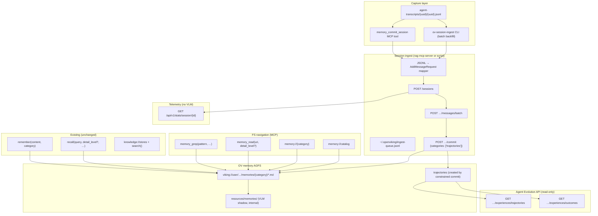

# Session Ingest and Memory FS Navigation

> **Status**: Spec — not implemented.

## Summary

Two complementary extensions to the OpenViking memory backend, building on
[specs/memory-tools.md](./memory-tools.md) (explicit `recall()` /
`remember()`) and [specs/vlm-tiered-retrieval.md](./vlm-tiered-retrieval.md)
(L0/L1/L2 progressive disclosure):

1. **Session ingest** (Track "A") — replay completed agent chats into
   OpenViking's session API (`messages/batch` → constrained `commit`) to
   produce **trajectories only**, then query them via the
   [Agent Evolution API](https://github.com/volcengine/OpenViking/blob/main/docs/en/api/19-agent-evolution.md).
   Telemetry (token counts, timings) comes from the cheap
   `GET /api/v1/stats/session/{session_id}` endpoint — no VLM needed.
   The status quo has things driven by human/agent decisions — when and
   what to remember and recall. OV's opinionated all-in-one session
   management (dedup, summarize, full extraction) defeats using RAG MCP
   server middleware, so Track A deliberately constrains the commit to
   `categories: ['trajectories']`, skipping other OV-generated categories
   we already maintain via `remember()`. The Agent Evolution API then
   serves as a read-only analytics layer over the created trajectories.
   Partially brings the main value of OV backend into middleware (agent
   session telemetry and traces).
2. **Memory FS navigation** (Track "B") — expose OV's AGFS metadata via MCP resources
   (`memory://…`), add extra FS-native tools, so agents can list and read
   memories by category, timestamp, or URI alongside semantic `recall()`.
   Brings the main value of OV backend into middleware - browseble traces
   metrics, and memories.

Both tracks keep the **knowledge/memory boundary** intact: knowledge stores
stay in rag-mcp-server (`knowledge://`); only agent memories live under
`viking://user/…/memories/`. The VLM shadow tree at
`resources/memories/` remains an internal dual-write artifact.
Alternatively, allow accessing arbitrary resources that OV user can read.
That allows uploading resources externally with OV cli.
Either textual/graphical, or audio/video (the summarization VLM then also
needs to be multi-modal - MLLM); having those processed by OV and usable
(semanthic search etc.) in the agent sessions afterwards.

## Background: what OV already provides (post 0.4.16)

rag-mcp-server currently uses a subset of the OpenViking HTTP API.

| API | Used today | Purpose |
|-----|------------|---------|
| `POST /api/v1/search/search` | Yes | Semantic recall, context-mode dedup |
| `POST /api/v1/content/write` | Yes | `remember()` → `memories/{category}/` |
| `GET /api/v1/content/read` | Yes | Full content (“cat”, L2) (with optional `offset` / `limit` lines); used by `_read_content()` |
| `GET /api/v1/content/abstract` | **No** | L0 abstract per URI (Track B: `memory_read` at L0) |
| `GET /api/v1/content/overview` | **No** | L1 overview per URI (Track B: `memory_read` at L1) |
| `GET /api/v1/fs/ls` | Internal | BM25 keyword-fallback listing; `list_memories()` |
| `GET /api/v1/fs/stat` | **No** | Per-entry size/mtime (Track B: `memory://{category}`) |
| `GET /api/v1/fs/tree` | **No** | Recursive listing (not planned — flat memory layout) |
| `POST /api/v1/resources` + `temp_upload` | Yes | VLM dual-write to `resources/memories/` |
| `POST /api/v1/sessions` | **No** | Track A: Create ingest session |
| `POST …/messages/batch` | **No** | Track A: Replay chat turns |
| `POST …/commit` | **No** | Track A: Archive + trajectory extraction |
| `POST …/extract` | **No** | Track A: Extract without full archive (optional) |
| `GET /api/v1/stats/session/{id}` | **No** | Track A: Cheap telemetry (tokens, timings) |
| `GET /api/v1/agent-evolution/experiences/trajectories` | **No** | Track A: Query trajectories by experience |
| `GET /api/v1/agent-evolution/experiences/outcomes` | **No** | Track A: Outcome distribution analytics |

> **NOTE:** OV splits filesystem metadata (`/api/v1/fs/*`) from content reads (`/api/v1/content/*`).

Design decisions already locked in (do not revisit here):

- **Dual-write for VLM**: `content/write` to `memories/` never triggers
  VLM; only `add_resource` does (3.x -> 4.x upgrade impact).
  Ingested memories must run the same `_trigger_vlm` path after commit
  if tiered retrieval is enabled.
- **Recall context mode**: read-only `recall()`. Ingest sessions should use a
  separate session ID namespace (`ingest-{chat_id}`), not the recall
  `client_id` used for dedup.
- **No knowledge in OV**: Path 3 from
  [docs/openviking-comparison.md](../docs/openviking-comparison.md) remains
  rejected. With a relaxed requirement of working with arbitrary OV resources
  including agent skills, rules, audio/video information (requires MLLM
  instead of VLM).

## Architecture



---

## Track A: Session ingest

### Problem

`remember()` depends on agent cooperation (~60% save reliability per
memory-tools.md). Long debugging sessions produce valuable facts that are
never persisted. OpenViking's session compressor and commit-time extractor
can solve this — but the ingest trigger must be an MCP tool (or batch CLI),
not an agent-harness-specific hook.

### Goal

After a chat completes, replay its transcript into OV and:

1. **Commit with constrained extraction** — `POST /api/v1/sessions/{id}/commit`
   with `categories: ['trajectories']` to produce only trajectory artifacts,
   skipping OV's full extraction (profile, preferences, entities, etc.) that
   we already manage through `remember()`.
2. **Collect telemetry cheaply** — `GET /api/v1/stats/session/{id}` for token
   counts and timings without invoking VLM.
3. **Query trajectories** — `GET /api/v1/agent-evolution/experiences/trajectories`
   as a read-only analytics layer over created trajectories, filterable by
   experience URI, date range, and pagination.

### OV 0.4.16+ alignment: resources vs live sessions

Do not confuse directly ingested (`ov add-resource`) info (docs, facts, knowledge) under `viking://resources/` with the session runtime storage.

| URI | What it is | Track A |
|-----|------------|---------|
| `viking://resources/…` | Project/user objects (docs, guides, repos) | Out of scope |
| `viking://user/{user}/sessions/{session_id}/` | Live session runtime (`messages.jsonl`, `history/archive_*`, `memory_diff.json`) | Managed by Track A via Sessions API |
| `viking://~/memories/` | Long-term memories after commit extraction | Artifacts that Track A produces |

**Track A prerequisites**:

1. VLM (a stronger model than summarization tasks needed), embedding model
   available for commit Phase 2 (async trajectory extraction).
   Costs are constrained because we request `categories: ['trajectories']`
   only — full extraction (profile, preferences, entities, etc.) is skipped
   (check if OV supports that!).
2. `memory_policy` on session create — only the `trajectories` category is
   requested; our six `remember()` categories (`preference`, `decision`,
   `learning`, `correction`, `context`, `workflow`) continue to be managed
   by rag-mcp middleware — no category remapping will be needed.

**Commit behaviour (constrained)**:

- Phase 1 (sync): archive messages →
  `…/sessions/{id}/history/archive_NNN/messages.jsonl`; API returns
  `status: "accepted"` + `task_id`.
- Phase 2 (async): trajectory extraction only (`.abstract.md`,
  `memory_diff.json` limited to trajectories, `.done` marker). Ingest
  worker must poll `get_task(task_id)` before assuming trajectories exist.

**Telemetry collection** (no VLM):

- `GET /api/v1/stats/session/{session_id}` returns token counts, message
  counts, and timing data. This replaces the need for VLM-based telemetry
  extraction.

**Trajectory query layer** (read-only):

- `GET /api/v1/agent-evolution/experiences/trajectories` returns paginated
  trajectories linked to an Experience, filterable by `experience_uri`,
  `start_date`, `end_date`.
- `GET /api/v1/agent-evolution/experiences/outcomes` returns outcome
  distribution counts across five supported outcomes.
- Both endpoints are read-only analytics over previously committed
  trajectories — they cannot create trajectories.

### Agent transcript format

Transcripts live under an agent-specific path, e.g. for Cursor:

```
~/.cursor/projects/{workspace-slug}/agent-transcripts/{chat-uuid}/{chat-uuid}.jsonl
```

Each line is a JSON object:

```json
{"role": "user", "message": {"content": [{"type": "text", "text": "…"}]}}
{"role": "assistant", "message": {"content": [
  {"type": "text", "text": "…"},
  {"type": "tool_use", "name": "Shell", "input": {"command": "…"}}
]}}
```

Properties relevant to mapping:

- `role`: `user` | `assistant` (system lines, if present, are skipped)
- `message.content[]`: typed parts (`text`, `tool_use`, …)
- No native `turn_id` — must be synthesized
- Timestamps may appear inside `<timestamp>…</timestamp>` in user text

### JSONL → OV message mapping

| Transcript source | OV `AddMessageRequest` | Notes |
|-------------------|------------------------|-------|
| `role: user`, text parts | `role: user`, `message_kind: user_query` | Strip `<timestamp>`, `<user_query>` wrappers |
| `role: assistant`, text parts | `role: assistant`, `message_kind: assistant_step` | Concatenate text parts |
| `role: assistant`, `tool_use` parts | `message_kind: tool_transport` | Serialize as `parts` array; truncate large outputs |
| Compaction / summary boundary (heuristic) | `message_kind: checkpoint` | Optional; detect `"summary"` or agent checkpoint markers |
| — | `turn_id` | `{chat_uuid}:{line_index}` or logical turn counter |
| — | `created_at` | From embedded timestamp or file mtime |

**Batching**: `POST …/messages/batch` accepts max 100 messages per request.
Long chats are chunked sequentially into the same OV session.

**Filtering** (reduce noise before ingest):

- Drop assistant lines that are only tool calls with no user-visible text
  (configurable; default: keep tool_use as `tool_transport`)
- Drop lines shorter than `INGEST_MIN_CONTENT_CHARS` (default 20)
- Optionally skip chats with fewer than `INGEST_MIN_USER_TURNS` (default 2)

### Session identity

| Field | Value | Rationale |
|-------|-------|-----------|
| OV `session_id` | `ingest-{chat_uuid}` | Stable 1:1 with Cursor chat; idempotent re-ingest |
| Recall `client_id` | Unchanged | Ingest sessions ≠ recall dedup sessions |
| Workspace tag | `workspace={slug}` | Provenance in commit metadata |

Create session with `POST /api/v1/sessions` if not exists; tolerate
409/conflict if session already present.

### Commit and extraction

Primary path: **`POST /api/v1/sessions/{session_id}/commit`**

```json
{
  "keep_recent_count": 0,
  "extraction_metadata": {
    "event": {
      "tags": [
        "source=cursor",
        "chat_id=<uuid>",
        "workspace=<slug>",
        "ingest_version=1"
      ]
    }
  }
}
```

- `keep_recent_count: 0` — archive entire chat (batch / end-of-session path)
- `extraction_metadata.event.tags` — strict `key=value` strings per OV schema
- Optional `retention_mode: turn_budget` for incremental commits (hook
  `afterAgentResponse` throttled path); defer to phase A2

Secondary path: **`POST …/extract`** — extract memories without archiving.
Use when the chat is still open and you want a mid-session snapshot without
closing the OV session. Not the default.

### Category mapping

None, we maintain status quo for memories, and only extract trajectories from sessions

### VLM dual-write after ingest

Extracted memories land under `memories/{category}/` via OV's commit pipeline.
When `RAG_MCP_TIERED_RETRIEVAL=true`, the ingest worker must invoke the
same `_trigger_vlm` dual-write used by `remember()` for each new memory URI
(or rely on OV `auto_generate_l0/l1` if a future OV version generates tiers
on commit output — today, use dual-write).

### Idempotency

| Mechanism | Purpose |
|-----------|---------|
| `ingest-{chat_uuid}` session ID | Same chat → same OV session |
| Content hash in `~/.openviking/ingest-state.json` | Skip if transcript unchanged |
| `chat_id` tag on committed memories | Find/delete stale extracts on re-ingest |
| Write-time dedup in `remember()` path | Cosine ≥ `DEDUP_THRESHOLD` skips near-duplicates |

Re-ingest policy: if transcript hash changed, delete prior memories tagged
`chat_id=<uuid>` (via `fs` delete or OV session archive lookup) before
re-commit, or accept duplicates and rely on dedup (configurable).

### Trigger matrix

| Trigger | Reliability | Portability | When to use |
|---------|-------------|-------------|-------------|
| **MCP `memory_commit_session`** | High | All MCP clients | Primary; agent or human invokes the tool at session end |
| **Batch CLI** (`ov-session-ingest`) | High | Any | Backfill, CI, manual one-off ingest |
| **Git post-commit hook** | Niche | Repo-scoped | Only when chat tied to commit; not recommended as primary |

The primary ingest path is the MCP tool — it works for every agent harness
that supports MCP, with no harness-specific hooks or bounds required. The
batch CLI covers backfill and CI scenarios.

#### Ingest queue

```
~/.openviking/ingest-queue.jsonl
```

Each line:

```json
{"transcript": "/path/to/{uuid}.jsonl", "enqueued_at": "2026-09-02T12:00:00Z", "status": "pending"}
```

Worker (`ov-session-ingest run`):

1. Dequeue pending entries
2. Map JSONL → messages
3. Create/reuse session `ingest-{uuid}`
4. Batch upload messages
5. Commit with `categories: ['trajectories']`
6. Mark queue entry `done` or `failed` with error

### MCP tool: `memory_commit_session` (optional, phase A3)

```python
async def memory_commit_session(
    transcript_path: str = "",
    chat_id: str = "",
) -> dict:
    """Commit a completed chat transcript to long-term memory.

    If transcript_path is empty, resolves the most recent transcript
    for the current workspace.  Delegates to the ingest worker.
  """
```

Returns: `{session_id, memories_created: [...], skipped: bool, reason: str}`.

Inferior to hooks (agent must remember to call) but portable.

### Configuration

| Variable | Default | Description |
|----------|---------|-------------|
| `RAG_MCP_INGEST_ENABLED` | `false` | Enable ingest worker and MCP tool |
| `RAG_MCP_INGEST_QUEUE` | `~/.openviking/ingest-queue.jsonl` | Queue file path |
| `RAG_MCP_INGEST_STATE` | `~/.openviking/ingest-state.json` | Transcript hash tracking |
| `RAG_MCP_INGEST_MIN_USER_TURNS` | `2` | Skip trivial chats |
| `RAG_MCP_INGEST_MIN_CONTENT_CHARS` | `20` | Drop noise lines |
| `RAG_MCP_INGEST_TOOL_TRUNCATE` | `4000` | Max chars per tool_use part |
| `RAG_MCP_INGEST_REINGEST` | `replace` | `replace` \| `skip` \| `allow_dup` |

Reuses existing `RAG_MCP_OPENVIKING_*` connection settings.

### Phased delivery (Track A)

| Phase | Deliverable |
|-------|-------------|
| **A0** | `scripts/ov-session-ingest.py` — `ingest`, `enqueue`, `run`, `--dry-run`; constrained commit (`categories: ['trajectories']`) |
| **A1** | Ingest queue + state file; idempotent hash skip; `GET /api/v1/stats/session/{id}` telemetry collection |
| **A2** | MCP `memory_commit_session` tool — primary ingest trigger for agents and humans |
| **A3** | Agent Evolution API integration — query trajectories and outcomes after commit |
| **A4** | Integration tests against live OV (constrained commit + stats + agent evolution queries) |

---

## Track B: Memory FS navigation

### Problem

`recall()` is semantic and progressive (L0→L2) but opaque when the agent
needs to browse by time, category, or known URI — e.g. "what did I save last
Tuesday in workflow?" or "re-read `viking://…/workflow/20260826T….md`".

`list_memories()` exists in `OpenVikingMemoryBackend` (wraps `fs/ls`) but is
not exposed to MCP clients. There is no `memory://` analog to
`knowledge://stores`.

### AGFS layout (flat by design)

```
viking://user/{user}/memories/
├── preference/
├── decision/
├── learning/
├── correction/
├── context/
└── workflow/
    └── {YYYYMMDD}T{HHMMSS}Z.md     # saved_at encoded in filename

viking://user/{user}/resources/memories/   # INTERNAL — VLM shadow tree
└── {category}/{file}.md/{file}.md
```

Navigation is **category + timestamp**, not topic hierarchy. Deep
directory-recursive retrieval (OV's strength for large corpora) adds little
for a flat memory store. Do not invent subdirectories.

### MCP resources (mirror `knowledge://` progressive discovery)

| Resource | Level | Content |
|----------|-------|---------|
| `memory://catalog` | L0 | Six categories, entry counts, newest `saved_at` each |
| `memory://{category}` | L1 | `fs/ls` listing: URI, filename, `saved_at`, size (via `fs/stat`) |
| `memory://{category}/{filename}` | L2 | `content/read` (or `abstract` / `overview` at L0/L1) via `TieredFormatter` |

Only registered when `RAG_MCP_MEMORY_BACKEND=openviking`.

Example `memory://catalog` output:

```markdown
# Memory Catalog

**Recall tool**: `rag_knowledge_recall`
**Browse tool**: `rag_knowledge_memory_read`

## Categories

| Category | Count | Newest |
|----------|-------|--------|
| workflow | 12 | 2026-08-26T11:22:11+00:00 |
| learning | 45 | 2026-08-28T09:00:00+00:00 |
…
```

`memory://workflow` lists recent entries (default limit 20, newest first).

### Optional MCP tools

| Tool | OV API | Use when |
|------|--------|----------|
| `memory_browse(path, limit?)` | `fs/ls` | List `viking://user/…/memories/{category}` |
| `memory_read(uri, detail_level?)` | `content/read`, `abstract`, `overview` | Direct URI; tier selects endpoint |
| `memory_grep(pattern, category?, saved_after?, saved_before?)` | `fs/ls` + `content/read` | Keyword search when recall/BM25 miss |

**Not exposed**: `fs/tree` on `resources/memories/` — avoids duplicate VLM
shadow paths confusing agents.

### Browse vs recall (advisory rule guidance)

| Task | Tool |
|------|------|
| "Anything about GPU passthrough?" | `recall(query, detail_level="L0")` → L1 → L2 |
| "What did I save on 2026-08-26?" | `memory_browse` or `memory://{category}` + date filter |
| "Re-read that workflow URI" | `memory_read(uri, detail_level="L2")` |
| "Find memories mentioning uni02beta" | `recall` first; `memory_grep` if recall empty |

Progressive disclosure unchanged: catalog (L0) → category list (L1) →
single file (L2). PNG wrap at L2 only (per vlm-tiered-retrieval.md).

### Shell grep vs MCP

Agents with filesystem access could grep `~/.openviking/data` directly.
Prefer MCP wrappers because they:

- Respect `TieredFormatter` and `detail_level`
- Hide `resources/memories/` shadow tree
- Work in sandboxed environments where AGFS path is not mounted
- Apply consistent auth headers

### Phased delivery (Track B)

| Phase | Deliverable |
|-------|-------------|
| **B0** | `memory://catalog` and `memory://{category}` resources |
| **B1** | `memory_read(uri, detail_level?)` tool |
| **B2** | `memory_grep(pattern, category?, saved_after?, saved_before?)` |
| **B3** | Advisory rule snippet: browse vs recall decision tree |
| **B4** | Unit tests (mock `fs/ls`, `content/read`) |

---

## Non-goals

| Non-goal | Rationale |
|----------|-----------|
| Ingest knowledge stores into OV | Blurs knowledge/memory boundary; duplicates `search()` |
| Expose `resources/memories/` in browse API | Internal VLM dual-write shadow; confuses agents |
| Replace `recall()` with FS navigation | Semantic search remains primary; browse is complementary |
| Use recall `session_id` for ingest sessions | Would pollute context-mode dedup (`auto_create=False` contract) |
| Full OV `fs/tree` on user root | Flat memory layout; tree adds token cost without benefit |
| Agent-harness-specific hook plugins | Design principle: expose MCP tools only, no harness bounds |

---

## Interaction with existing features

### Tiered retrieval

- Ingested memories participate in the same L0/L1/L2 pipeline as
  `remember()` output.
- `memory_read` and `memory://{category}/{filename}` honor `detail_level`.
- VLM dual-write runs on ingest when `RAG_MCP_TIERED_RETRIEVAL=true`.

### Recall dedup

- Ingest sessions (`ingest-*`) are isolated from recall context mode.
- `recall(client_id=…)` behavior unchanged.

### Local memory backend

- Track A (session ingest) is **OpenViking-only** — OV provides the session
  compressor/extractor.
- Track B (FS navigation) is **OpenViking-only** — no AGFS in local backend.
- Local backend could gain a read-only `memory://catalog` from filesystem
  scan in a future spec if needed.

---

## Files to create/modify

### Track A

- `scripts/ov-session-ingest.py` — CLI: `ingest`, `enqueue`, `run`, `status`
- `src/rag_mcp/session_ingest.py` — JSONL mapper, OV session client, queue
- `src/rag_mcp/memory_tools.py` — `memory_commit_session` MCP tool
- `src/rag_mcp/config.py` — ingest config fields
- `tests/test_session_ingest.py` — mapper unit tests, mock OV commit

### Track B

- `src/rag_mcp/memory_resources.py` — `memory://` MCP resources
- `src/rag_mcp/memory_tools.py` — `memory_read`, `memory_grep`, `memory_browse`
- `src/rag_mcp/memory/openviking.py` — `fs/stat`, expose `list_memories` metadata
- `tests/test_memory_resources.py`
- `templates/memory-advisory.mdc` — browse vs recall section

### Documentation

- `README.md` — link to this spec under Cross-session memory
- `specs/memory-tools.md` — add Related link
- `docs/openviking-comparison.md` — update integration paths table

---

## Testing strategy

| Area | Approach |
|------|----------|
| JSONL mapper | Fixture transcripts; assert `AddMessageRequest` shapes |
| Idempotency | Same transcript twice → skip; changed hash → replace |
| Commit | Mock OV HTTP; verify tags and session ID |
| `memory://catalog` | Mock `fs/ls` per category |
| `memory_grep` | Fixture memories; pattern + date filter |
| E2E | Requires live OV + Ollama; manual or optional CI job |

---

## Open questions

1. **Transcript discovery**: how does the MCP tool or batch CLI locate the
   correct JSONL file? Workspace slug + latest mtime glob, or explicit path arg?
2. **OV extractor → rag-mcp categories**: commit writes to `viking://~/memories/`
   using OV native types (`preferences/`, `events/`, …). Can we skip full extraction
   in OV sessions API?
3. **Incremental commit**: is throttled commit with
   `keep_recent_count: 10` worth the complexity for long-running chats?
4. **Draft memories**: should ingest produce `status=draft` until user
   confirms, or trust extractor quality?

---

## Related documents

- [specs/memory-tools.md](./memory-tools.md) — `recall()` / `remember()` design
- [specs/vlm-tiered-retrieval.md](./vlm-tiered-retrieval.md) — L0/L1/L2 tiers
- [docs/openviking-comparison.md](../docs/openviking-comparison.md) — integration paths
- [docs/k8s-agentic-landscape.md](../docs/k8s-agentic-landscape.md) — session memory in agentic stack
