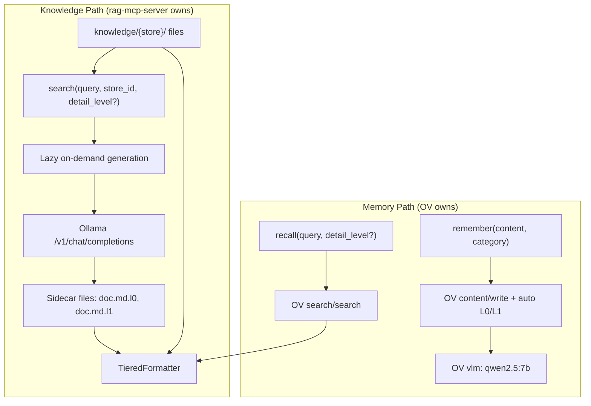

# VLM Tiered Retrieval Integration

> **Status**: Spec — implementation drifted.

## Summary

Integrate OpenViking's VLM-generated L0/L1 summaries into both `search()`
and `recall()` tools, adding a tiered rollout mechanism where compact
summaries are returned first and full content (L2) is available on demand.

- **Knowledge L0/L1**: Generated by rag-mcp-server itself (calls Ollama
  LLM directly), stored as sidecar files alongside originals. No OV
  involvement.
- **Memory L0/L1**: Generated by OV (`auto_generate_l0/l1`), stored in
  OV's AGFS under `viking://user/.../memories/`. No knowledge files in OV.

## Architecture



**Why not ingest knowledge into OV?** OV's search API operates on its
entire AGFS. If knowledge files coexist with memories under the same OV
instance, `recall()` would return knowledge docs alongside personal
memories — duplicating `search()` and blurring the knowledge/memory
boundary.

## Detail levels

| Level | Tokens | Content | PNG wrap | Use case |
|-------|--------|---------|----------|----------|
| L0 | ~100 | One-line abstract per result | Never | Browsing, deciding relevance |
| L1 | ~2000 | Overview paragraph per result | Never | Quick context, enough for most tasks |
| L2 | full | Complete document content | Yes (if enabled) — both `search()` and `recall()` | Deep reading, code extraction, full procedures |

Default: `detail_level="L1"` for both `search()` and `recall()`. Agent
(or advisory rule) requests L0 for broad scans, L2 for deep dives.

## Progressive disclosure pattern for memories

The baseline impact of tiered recall depends on memory length. Short
memories (preference, correction, decision) are typically < 100 tokens
already — L0/L1/L2 collapse to the same content, and VLM generation at
write time is pure overhead. Long memories (workflows, learnings) benefit
significantly.

**Token budget comparison** — `recall("GPU deployment", top_k=10)`:

| detail_level | Tokens returned | Use |
|---|---|---|
| L0 | ~1000 (10 x 100) | Scan and filter — find which memories are relevant |
| L1 | ~5000 (10 x 500 avg) | Act on most tasks without expansion |
| L2 | ~15000 (10 x 1500 avg) | Full procedures, code blocks, complete reasoning |

**Recommended agent pattern** (document in advisory rule):

1. `recall(query, detail_level="L0")` — browse results, identify relevant items
2. `recall(refined_query, detail_level="L2")` — expand only what's needed

Total: ~4000 tokens vs 15000 tokens for unconditional L2 dump.

**When L0/L1 generation is wasteful** (short-circuit):

Applies to both paths — rag-mcp-server (knowledge sidecars) and OV
(memory summaries):

- Content < 100 tokens → skip L0 generation (content IS the L0). Don't
  write `.l0` sidecar / don't trigger OV summarizer.
- Content < 2000 tokens → skip L1 generation (content IS the L1). Don't
  write `.l1` sidecar / don't trigger OV summarizer.
- At read time: if sidecar missing, TieredFormatter returns the original
  content at that level (it's short enough to serve as its own summary).

Short files and short memories never pay the LLM cost — the lazy path
checks content length before calling Ollama and skips when the file is
already within the target level's token budget.

**When it pays off**:

- Workflow memories (multi-step procedures with code): L0 = title, L1 = outline, L2 = full procedure
- Learning memories (debugging sessions): L0 = root cause, L1 = explanation, L2 = full trace
- Context memories (background narrative): L0 = topic sentence, L1 = summary, L2 = full text

**Write-time cost**: +2-5s per `remember()` call when VLM generates
L0/L1. Acceptable for memories saved a few times per session; prohibitive
if agent over-saves.

## Agent behavior: when to request which level for `search()`

The advisory rule (or persona instructions) should guide the agent on
which `detail_level` to use.

**Default behavior (no advisory rule change needed)**:

- `detail_level="L1"` is the default — agent calls `search(query, store_id)`
  as before, gets ~500-word overviews instead of full documents.

**Progressive disclosure pattern for knowledge**:

| Agent task | Recommended pattern | Why |
|---|---|---|
| Exploring unfamiliar domain | `search(broad_query, store, detail_level="L0")` | Scan many titles quickly, decide what's relevant |
| Answering a specific question | `search(query, store)` (default L1) | Overview is usually enough to answer |
| Extracting code/config snippets | `search(query, store, detail_level="L2")` | Need full document with code blocks |
| Multi-store lookup | L0 across stores, then L1/L2 in the relevant one | Minimize token cost on irrelevant stores |

**Advisory rule snippet** (for `.mdc` or persona):

```
When searching knowledge stores:
- Use detail_level="L0" when scanning broadly (>5 results expected)
- Use default (L1) for most questions — summaries are sufficient
- Use detail_level="L2" only when you need exact code, YAML, or full procedures
- Never request L2 with top_k > 3 — budget will be exceeded
```

**Impact on existing agent behavior**:

- Agents that never pass `detail_level` get L1 by default — shorter
  responses than before (was full L2), but sufficient for 80% of tasks
- Agents that need the old behavior (full text) must explicitly pass
  `detail_level="L2"`
- This is a **breaking change in response size** if
  `RAG_MCP_TIERED_RETRIEVAL=true` — document clearly that enabling
  tiered retrieval changes the default from "full content" to "overview"

## Changes to existing tools

### `search()` — add `detail_level` parameter

```python
async def search(
    ctx: Context,
    query: str,
    vector_store_id: str,
    top_k: int = 5,
    detail_level: str = "L1",  # NEW: "L0", "L1", "L2"
):
```

When tiered retrieval is enabled:

- Search runs normally (mock keyword/semantic, solr, confluence)
- For each result, look up sidecar files (`{path}.l0`, `{path}.l1`)
- Formatter selects which level to include based on `detail_level`
- If sidecar missing for a result, fall back to extractive approximation
  (title + first sentence for L0, first 2000 chars for L1)

No OV involvement in the knowledge search path — summaries are local
sidecar files.

### `recall()` — add `detail_level` parameter

```python
async def recall(
    ctx: Context,
    query: str,
    category: str = "",
    top_k: int = 5,
    detail_level: str = "L1",  # NEW
):
```

OV's search API stores L0/L1 when `auto_generate_l0/l1` is enabled in
`ov.conf`. OV only contains memories (never knowledge files). Add `level`
or equivalent filter to the query to control which tier of the memory is
returned.

### `remember()` — no parameter changes needed

With `auto_generate_l0: true` and `auto_generate_l1: true` in `ov.conf`,
OV generates summaries on write automatically. No code change needed in
`remember()` itself, just `ov.conf` documentation.

## No separate `ingest` tool — lazy path is the only mechanism

There is no explicit `ingest()` tool or CLI command. L0/L1 generation is
triggered **exclusively by search hits** — the same code path for both
mock and OKP backends:

1. `search()` returns results
2. For each result, check if sidecar exists and is fresh
3. If needed (content exceeds threshold), fire background LLM call
4. Write sidecar when done

This is deterministic: only files that are actually searched and returned
get summarized. Files that are never hit never consume LLM resources.

Sidecar file layout (generated on demand):

```
knowledge/nova-dev/
├── scheduling.md       <- L2 (original)
├── scheduling.md.l0    <- generated after first search hit
├── scheduling.md.l1    <- generated after first search hit
├── live-migration.md   <- never searched → no sidecars
└── .ingest-state.json  <- {"scheduling.md": {"hash": "abc123", "generated_at": "..."}}
```

For OKP/Solr, cache lives in `RAG_MCP_SUMMARIES_DIR`:

```
.summaries-cache/
├── {doc_id_1}.l0
├── {doc_id_1}.l1
├── {doc_id_2}.l0
└── ...
```

Benefits:

- Simpler API surface (no ingest tool for agents to reason about)
- No wasted LLM calls on files that are never searched
- Same deterministic behavior on both backends
- Sidecars accumulate naturally as the system is used

## `TieredFormatter` in `formatting.py`

Applies to **both** OV and mock/solr/confluence paths for a consistent
API. When OV-generated summaries are available, they're used; otherwise,
extractive approximation fills in.

- **L0 mode**: OV path uses `l0_summary` field. Mock fallback extracts
  title + first sentence. One line per result. Plain text only.
- **L1 mode**: OV path uses `l1_summary` field. Mock fallback extracts
  first 2000 chars. Full attribution. Default. Plain text only.
  - **Corner case handling**: If VLM-generated summary exceeds original L2 in size
    (rare degenerate case), fall back to L2 instead
- **L2 mode**: Full text on both paths. Applies existing
  `max_response_chars` budget. **PNG wrap (optical compression) only
  applies at this level.**

| Source | L0 | L1 | L2 |
|--------|----|----|-----|
| OV (VLM) | VLM-generated abstract | VLM-generated overview | Full content, `max_response_chars` budget |
| Mock fallback | Title + first sentence (extractive) | First 2000 chars (truncation) | Full content, `max_response_chars` budget |

The agent doesn't need to know which path produced the result — same
`detail_level` parameter, same response shape.

### PNG wrap gating logic (both `search()` and `recall()`)

PNG framing applies at L2 for **both** knowledge search and memory
recall — full content is dense enough to benefit from optical compression.

```python
if app.config.png_wrap and detail_level == "L2":
    return wrap_as_images(formatted, max_pages=app.config.png_max_pages)
return formatted
```

When `detail_level` is L0 or L1, `png_wrap` is bypassed regardless of
configuration.

## Configuration

| Variable | Default | Description |
|----------|---------|-------------|
| `RAG_MCP_TIERED_RETRIEVAL` | `false` | Enable tiered L0/L1/L2 |
| `RAG_MCP_DEFAULT_DETAIL_LEVEL` | `L1` | Default detail level for search/recall |
| `RAG_MCP_SUMMARIZER_URL` | (from `embedding_url`) | Ollama endpoint for L0/L1 generation (`/v1/chat/completions`) |
| `RAG_MCP_SUMMARIZER_MODEL` | `qwen2.5:7b` | Model for summarization (any chat-capable model) |
| `RAG_MCP_SUMMARIZER_TIMEOUT` | `180` | HTTP timeout in seconds for summarizer requests. Increase for slow backends (e.g. vLLM on constrained GPUs like L4) |
| `RAG_MCP_SUMMARIES_DIR` | `.summaries-cache` | Local directory for cached L0/L1 sidecars (both mock and solr) |

When `RAG_MCP_TIERED_RETRIEVAL=false` (default), behavior is unchanged —
`detail_level` parameter is ignored, full text always returned.

Both mock and solr backends use the same lazy on-demand model: extractive
fallback on first hit, background LLM generation for subsequent queries.

Note: `RAG_MCP_SUMMARIZER_URL` is the Ollama (or compatible) **chat
completions** endpoint used by rag-mcp-server to generate knowledge
summaries. This is separate from OV's own `vlm` config which handles
memory summarization internally.

## OV VLM configuration

### Choosing a model for the `vlm` key in `ov.conf`

Despite its name, the `vlm` config key in OV is simply "the model used
for content understanding." It accepts any OpenAI-compatible
`/v1/chat/completions` endpoint. OV uses it to generate L0/L1 text
summaries — actual vision capability is only needed for multimodal
resource ingestion (PDFs, images).

**The two models in `ov.conf` serve different purposes:**

| Config key | What it does | Called when | Model type |
|---|---|---|---|
| `embedding.dense` | Vector embeddings for semantic search index | Every `content/write` and `search` | Embedding model (nomic-embed-text, 274MB) |
| `vlm` | Text summarization → L0/L1 generation | Every `content/write` (if `auto_generate_l0/l1`) | LLM — not actually a VLM unless you need vision |

The `vlm` key is **optional** — without it, OV stores content as-is (L2
only) and recall still works via embeddings. Adding it enables the
summarization layer at the cost of write latency and disk for the model.

**Model options:**

| Model | Size | L0/L1 quality | Latency | Use case |
|-------|------|---------------|---------|----------|
| `qwen2.5:3b` | 1.9GB | Acceptable for short docs | ~1-2s | Minimal footprint, CI |
| `qwen2.5:7b` | 4.4GB | Good (recommended) | ~2-5s | Default for dev workstations |
| `llama3.1:8b` | 4.7GB | Good | ~2-5s | Alternative if qwen unavailable |
| `llava:7b` | 4.7GB | Good + vision | ~3-8s | Multimodal ingestion (PDFs, images) |
| OpenAI-compatible API | 0 local | Best | ~0.5-1s | Cloud, team-shared OV instance |

Guidance: use a text-only LLM unless ingesting binary content. For
memories-only (agent `remember()`), text is always pre-structured — VLM
vision is never needed.

### `auto_generate_l0` / `auto_generate_l1`

Full `ov.conf` snippet for tiered retrieval:

```json
{
  "storage": {
    "workspace": "~/.openviking/data",
    "vectordb": { "name": "memories", "backend": "local" },
    "agfs": { "backend": "local" }
  },
  "embedding": {
    "dense": {
      "provider": "ollama",
      "model": "nomic-embed-text",
      "api_base": "http://127.0.0.1:11434/v1",
      "dimension": 768
    }
  },
  "vlm": {
    "provider": "ollama",
    "model": "qwen2.5:7b",
    "api_base": "http://127.0.0.1:11434/v1",
    "temperature": 0.0,
    "max_retries": 2
  },
  "auto_generate_l0": true,
  "auto_generate_l1": true,
  "server": {
    "host": "127.0.0.1",
    "port": 1933,
    "auth_mode": "trusted"
  }
}
```

- `auto_generate_l0: true` — on every `content/write`, OV generates a
  ~100 token abstract
- `auto_generate_l1: true` — on every `content/write`, OV generates a
  ~2k token overview
- Both are stored alongside L2 (full content) and returned by search at
  the requested level
- Disk cost: negligible (summaries are small), but write latency
  increases by 2-5s per file

### Auto-ingestion: mock vs OKP backends

Both backends generate L0/L1 by calling Ollama directly from
rag-mcp-server (not OV). Both use the **same lazy on-demand model** — no
startup cost, consistent behavior:

| Aspect | Mock (local files) | OKP/Solr (external service) |
|--------|-------------------|----------------------------|
| Corpus size | Small (< 500 files) | Potentially millions of docs |
| Ingestion trigger | On first search hit for a file | On first search hit for a doc |
| L0/L1 storage | Sidecar files: `{file}.l0`, `{file}.l1` in store dir | Cache dir: `{SUMMARIES_DIR}/{doc_id}.l0/.l1` |
| Freshness check | Content hash vs `.ingest-state.json` | TTL-evicted (Solr content changes) |
| Cold start | Extractive fallback, LLM fires in background | Extractive fallback (`portal_synopsis`), LLM fires in background |

#### Mock backend: lazy on-demand

When `RAG_MCP_TIERED_RETRIEVAL=true` and backend is `mock`:

1. `search()` runs normally (keyword/semantic over local files)
2. For each result, check if `{file}.l0` and `{file}.l1` exist with
   matching content hash
3. If sidecars exist and fresh: return at requested `detail_level`
4. If missing: check content length before deciding whether to generate:
   - Content < 100 tokens → no `.l0` needed (content serves as its own L0)
   - Content < 2000 tokens → no `.l1` needed (content serves as its own L1)
   - Content >= threshold → return extractive approximation now, fire
     background Ollama call
5. Write sidecars + update `.ingest-state.json` when background
   generation completes (only for files that exceed the threshold)

**First search** for a given file returns extractive L0/L1. **Subsequent
searches** return LLM-generated summaries.

#### OKP/Solr backend: on-demand summarization

When backend is `solr`:

1. `search()` queries Solr normally (BM25/semantic/hybrid)
2. For each result, check local cache dir (`.summaries-cache/{doc_id}.l0/.l1`)
3. If cached and fresh: return at requested `detail_level`
4. If not cached: return Solr's `portal_synopsis` as L1 approximation
   (extractive), fire background Ollama call to generate proper L0/L1
   for future queries

**First search** for a given doc returns extractive L1 (Solr snippet).
**Subsequent searches** return LLM-generated L0/L1.

When `RAG_MCP_TIERED_RETRIEVAL=false`, no LLM calls are made — both
backends return full content (L2) as before.

## Graceful degradation

| Scenario | Knowledge search | Memory recall |
|----------|-----------------|---------------|
| Ollama running + sidecars generated | Full tiered (L0/L1/L2) | — |
| Ollama down | Extractive fallback (title/truncation) | — |
| No sidecars yet (cold start) | Extractive fallback, background generation | — |
| OV running + `vlm` configured | — | Full tiered (L0/L1/L2) |
| OV running + no `vlm` key | — | L2 only (full content) |
| OV down | — | Memory tools return "disabled" |
| `RAG_MCP_TIERED_RETRIEVAL=false` | L2 only (current behavior) | L2 only (current behavior) |

## Files to create/modify

### Code

- `src/rag_mcp/tools.py` — add `detail_level` parameter to `search()`,
  gate PNG wrap to L2 only
- `src/rag_mcp/memory_tools.py` — add `detail_level` to `recall()`
- `src/rag_mcp/memory/openviking.py` — pass level to OV search API for
  memory tier selection
- `src/rag_mcp/formatting.py` — `TieredFormatter` with L0/L1/L2
  rendering (extractive fallback when sidecars missing)
- `src/rag_mcp/config.py` — new tiered retrieval config fields
  (`SUMMARIZER_URL`, `SUMMARIZER_MODEL`, `SUMMARIZER_TIMEOUT`, `SUMMARIES_DIR`)
- `src/rag_mcp/_app.py` — wire summarizer into AppContext
- `src/rag_mcp/backends/solr.py` — check/trigger sidecar generation for
  search results
- `src/rag_mcp/summarizer.py` (new) — thin Ollama `/v1/chat/completions`
  client + background task runner for L0/L1 generation
- `src/rag_mcp/sidecars.py` (new) — read/write/check sidecars,
  hash-based state tracking, content-length threshold logic

### Documentation

- `README.md` — expand OV section: VLM model selection table, full
  `ov.conf` with `auto_generate_l0/l1`, on-demand behavior
- `specs/memory-tools.md` — update "Optional: LLM/VLM" section with full
  integration details, mock vs OKP ingestion model
- `docs/openviking-comparison.md` — update "L0/L1/L2 as a design
  pattern" section to reflect actual implementation

### Tests

- TieredFormatter (L0/L1 extractive, L2 full, PNG only at L2)
- Sidecar manager (hash tracking, idempotency, threshold skip)
- OKP cache miss/hit behavior

## Related documents

- [specs/memory-tools.md](./memory-tools.md) — memory tool design
- [specs/rag-mcp-server.md](./rag-mcp-server.md) — RAG MCP server design
- [docs/openviking-comparison.md](../docs/openviking-comparison.md) —
  OV comparison and integration paths
- [specs/lightspeed-core-solr.md](./lightspeed-core-solr.md) — Solr
  semantic/hybrid search options
